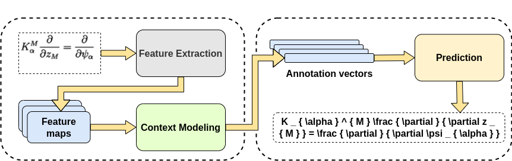
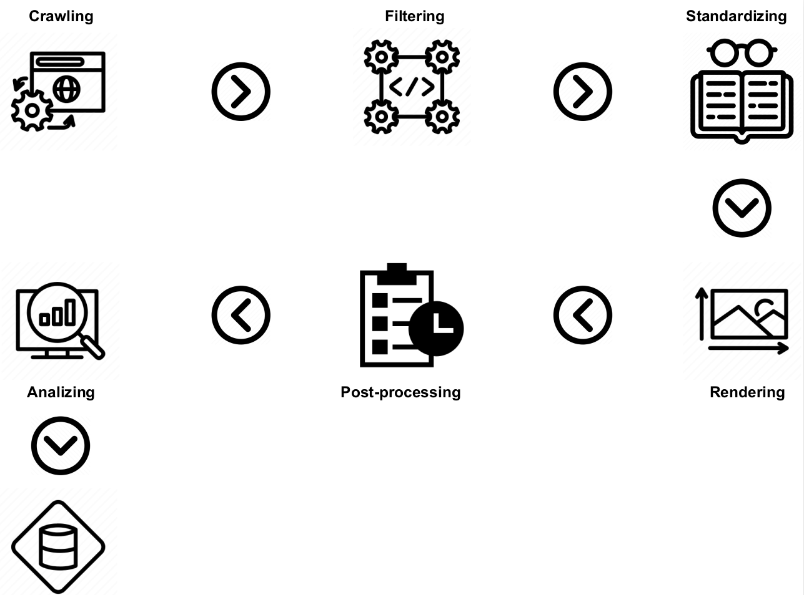

<p align="center">
  
  <br>
  <a href="https://github.com/duylebkHCM/doc2tex/LICENSE"></a>
  <a href="https://hub.docker.com/r/duybktiengiang1603/doc2tex"></a>
  <a href="https://huggingface.co/spaces/duycse1603/thesis_demo"></a>

</p>

# Doc2TeX: A framework for converting mathematical expressions into LaTeX format

<p align="center">
  
</p>

- A comprehensive PyTorch framework for extracting mathematical expression from scientific documents like books, research papers, i.e. The framework focus on two main task including **Math Expression Detection** and **Math Expression Recognition**. </br>
- Doc2TeX framework allows researchers and practitioners to quickly experiment new idea with many architectures, fully supported evaluation metrics and even create new dataset.

# Requirements and Installation
Currently, there are two options to use this repo for research and development purpose.
## With Pip
 - Create virtual environment using Anaconda
 - Make sure using Python version >= 3.8
 - [PyTorch](http://pytorch.org/) version >= 1.8.0
 - **To install doc2tex** and develop locally:
 ``` bash
  git clone https://github.com/duylebkHCM/doc2tex
  cd doc2tex
  conda create -n doc2tex python=3.8.5
  pip install -r envs/requirements.txt
  ```

## With Docker
Docker provides a virtual machine with everything set up to run Doc2TeX, whether you will leverage a GPU or just run on a CPU. Docker provides more isolation and consistency, and also makes it easy to distribute your environment to a compute cluster.
Doc2TeX provides official Docker image for [training](https://hub.docker.com/r/duybktiengiang1603/doc2tex) with the library and all of its dependencies installed and [for inferencing and building dataset](https://hub.docker.com/r/duybktiengiang1603/doc2tex_infer).

Once you have [installed Docker](https://docs.docker.com/engine/installation/),
you should also install the [NVIDIA Container Toolkit](https://github.com/NVIDIA/nvidia-docker)
if you have GPUs available.

Start with downloading the docker images from DockerHub:
```bash
docker pull duybktiengiang1603/doc2tex:latest
docker pull duybktiengiang1603/doc2tex_infer:latest
```

Then run the following command to get an environment to begin training models on GPU:

```bash
docker run --rm --gpus all -v path_to_dataset:path_to_mount_dataset -v $HOME/doc2tex/:/workdir duybktiengiang1603/doc2tex:latest
```

# Table Of Contents
-  [Highlights](#highlights)
-  [Framework Structure](#framework-structure)
-  [Dataset](#dataset)
-  [Instruction](#instruction)
-  [Demo](#demo)
-  [Future Work](#future-work)
-  [Documentation](#documentation)
-  [Contributing](#contributing)
-  [Citation](#citation)
-  [Acknowledgments](#acknowledgments)

# Highlights
- **Modular design**
    <p align="center">
    
    </p>
    Users can easily define new architectures for each stage including Feature Extraction, Sequence Modeling and Prediction for Math Recognition task and then combine multiple modules into one models. Users can also define own loss functions and optimizers and apply for training with just a few lines of code.

- **Comprehensive pipeline**

  Doc2TeX support users with an end-to-end preprocessing, training, postprocessing and evaluation pipeline with just one config file. Also, a multi-step pipeline for creating brand new dataset.

- **Numerous Utilities**

  The framework provides to users multiple utilities for many sub-tasks which allow users to perform evaluations, postprocessing, visualization, interpretation.


# Framework Structure
The framework contains some following main components:

```
|
├── api
|   └── train.py   Training script
│   └── infer.py   Inferencing script
|
├──  config
│    └── train.yaml  - training config file.
│    └── train.yaml  - training config file.
│
├──  doc2tex
│    └── data - Dataset processing logic
|    └── engine - Define train methods and validation methods
│    └── modules - Contain all components used for training and evaluation process
|    |    └── component - Contain all architecture to define a complete model
|    |    |   └── common
|    |    |         └── ...
|    |    |   └── feature_extractor
|    |    |         └── ...
|    |    |    └── seq_modeling
|    |    |         └── ...
|    |    |    └── prediction_head
|    |    |         └── ...
|    |    └── converter -Define methods to convert input sequences into tokens
|    |    └── loss -Define criterion classes
|    |    └── metrics -Define text evaluation metrics
|    |    └── optim -Define optimizer classes
|    |    └── recognizers
|    |    └── build_model.py Main model class
|    └── tools
|    |    └── build_data -Contain all step to build a new dataset
|    |    └── intepretation -Classes to perform visualization attention maps
|    |    └── lmdb_builder -Build lmdb dataset format
|    |    └── result_evaluate -Methods to evaluate image-based metrics
|    |    └── beam.py - Beam search algorithm
|    └── transform
|    |    └── geo_transform.py -Geometry transformation
|    |    └── math_transform.py -Main augmentation class
|    └── utils -Collections of helper functions
          └── ...
```

# Dataset
## Mathematical Expression Recognition dataset
Users can download IM2LATEX-100K dataset from this link [im2latex-100k-dataset](https://zenodo.org/record/56198#.V2p0KTXT6eA) or a preprocessed version from this link [preprocess im2latex-100k](https://im2markup.yuntiandeng.com/data/) to start experiment.

Or, if users decide to create new dataset, in case, im2latex-100k dataset is not large enough, the users can follow these steps:


<div align="center"></div>

- Step 1:
```bash
  cd doc2tex/tools/build_data
  python collect_latex/arxiv.py
```
- Step 2:
```bash
  python latex_processing/normalize_formula.py
```

- Step 3:
```bash
  python render_data/pdflatex_render.py
```

- Step 4:
```bash
  python construct_label/standard_total_df.py
  python construct_label/generate_latex_vocab.py
  python construct_label/find_threshold.py
  python construct_label/get_recheck_textline.py
  python construct_label/process_recheck_textline.py
  python construct_label/augmentation_dupp.py
```

- Step 5:
```bash
  cd utils/lmdb_builder
  python create_lmdb_dataset.py
```

## Mathematical Expression Detection dataset
Coming soon.

# Instruction
## Training
We recommend to perform training using GPU support machine.

```bash
  CUDA_VISIBLE_DEVICES=cuda_id python api/train.py --config config/train.yaml
```

## Evaluating
We recommend to use doc2tex_infer docker image for inferencing step as it provides all the required debian package for image-based evaluation metrics like pdflatex, imageMagik.

- For inference step:
```bash
  python api/infer.py --data_dir path_to_image --csv_dir path_to_latex_eq --strong_log --config config/test.yaml
```
- For evaluation step (image-based):
```bash
  python tools/result_evaluate/pdflatex_render.py --result-path path_to_output_csv --output-dir path_to_save_render_images
  python tools/result_evaluate/evaluate_images.py --image-gold path_to_groundtruth_imgs --predict-gold path_to_rendered_imgs
```

# Demo
An [interactive Streamlit](https://huggingface.co/spaces/duycse1603/thesis_demo) demo hosted at Hugging Face is available.

# Future Work

- [ ] CI/CD
- [ ] Documentation
- [ ] Math Detection full support
- [ ] More Math Recognition architectures

# Documentation
Coming soon.

# Contributing
Any kind of enhancement or contribution is welcomed.

# Citation
This project is implemented as part of my research paper. So if you find it is useful, please consider citing this work in your publications if it helps your research.

```bibtex
@INPROCEEDINGS{10034626,
  author={Le, Anh Duy and Pham, Van Linh and Ly, Vinh Loi and Nguyen, Nam Quan and Nguyen, Huu Thang and Tran, Tuan Anh},
  booktitle={2022 International Conference on Digital Image Computing: Techniques and Applications (DICTA)},
  title={A Hybrid Vision Transformer Approach for Mathematical Expression Recognition},
  year={2022},
  volume={},
  number={},
  pages={1-7},
  doi={10.1109/DICTA56598.2022.10034626}}
```

# Acknowledgments
This framework is based on following repos [deep-text-recognition-benchmark](https://github.com/clovaai/deep-text-recognition-benchmark/tree/master), [im2markup](https://github.com/harvardnlp/im2markup), [LaTeX-OCR](https://github.com/lukas-blecher/LaTeX-OCR)
